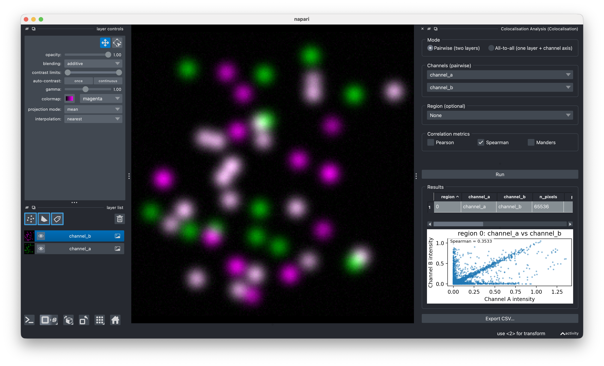

---
hide:
  - navigation
---

<figure markdown="span">
  { width=160 }
</figure>

# napari-colocalization

!!! warning "Under construction — pre-alpha"

    APIs, UI, and outputs may change without notice. Not recommended
    for production analysis yet; use at your own risk and please
    report rough edges via the
    [issue tracker](https://github.com/DBI-INFRA/napari-colocalization/issues).

Interactive intensity-colocalization analysis for [napari](https://napari.org).
Pick two channels (or one multi-channel image), optionally restrict the
analysis to a region drawn as shapes or labels, choose your metric, and get a
results table plus an intensity-vs-intensity scatter plot — all without
leaving napari.

<figure markdown="span">
  { width=780 }
</figure>

## Features

- **Three correlation metrics**: Pearson (PCC), Spearman rank (SRCC), and
  Manders' coefficients M1/M2 (MCC).
- **Pairwise or all-to-all** mode: analyse two grayscale layers, or every
  channel pair within a single multi-channel layer.
- **2D and 3D** support natively (no time-series for now).
- **Region-restricted analysis** via a Shapes or Labels layer — each non-zero
  region is reported on its own row.
- **Manders thresholds**: choose **Costes auto** (iterative regression-based)
  or **Manual**.
- **Interactive results**: in-widget table, scatter plot of the selected row,
  multi-row selection that highlights all matching shapes/labels in the viewer.
- **CSV export** of the current table.

## Installation

```bash
pip install napari-colocalization
```

If napari isn't already installed, install both at once:

```bash
pip install "napari-colocalization[all]"
```

## Where next?

- **[Usage guide](usage.md)** — every control in the widget, in order.
- **[Metrics](metrics.md)** — what PCC, SRCC and MCC mean, when to use
  which, and how the Costes auto-threshold works.
- **[Python API](api.md)** — calling the pure-compute layer
  (`pearson`, `spearman`, `manders`, `costes_threshold`,
  `analyse_pairwise`, `analyse_all_to_all`) from scripts or notebooks.
  Reference is auto-generated from the source docstrings.

## Source code

The plugin lives at
[github.com/DBI-INFRA/napari-colocalization](https://github.com/DBI-INFRA/napari-colocalization).
File issues or feature requests on the tracker there.
