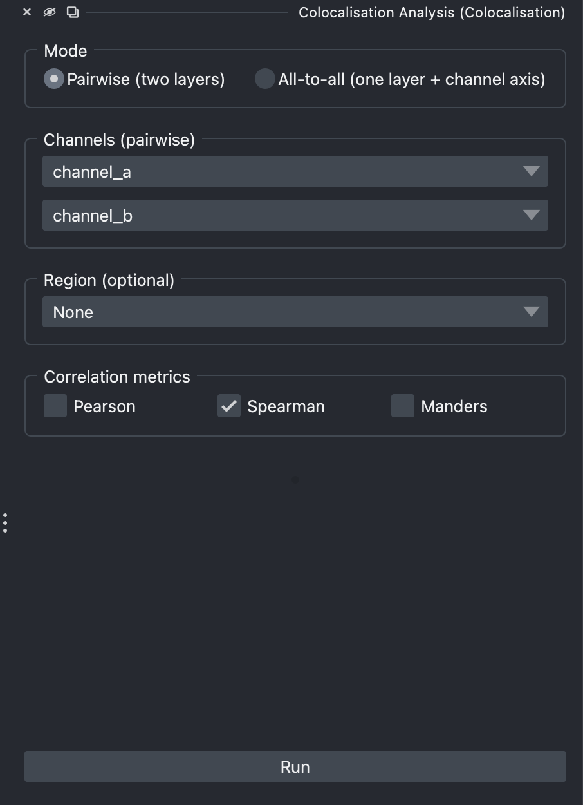

# Usage guide

This page walks through every control in the **Colocalization Analysis**
dock widget, top to bottom.

> Documentation index: [Home](index.md) · **Usage** · [Metrics](metrics.md) · [Python API](api.md)

## Opening the widget

In napari: **Plugins → Colocalization Analysis**. The widget docks on the
right by default. To follow along without your own data, load a sample:
**File → Open Sample → napari-colocalization → Colocalization sample (2D)**.
A 3D synthetic version is also provided, plus **CBS006RBM** - a
two-channel benchmark image (~50 % colocalization) downloaded once and
cached under `~/.cache/napari-colocalization/` from the
[Colocalization Benchmark Source](https://colocalization-benchmark.com).

<figure markdown="span">
  { width=380 }
  <figcaption>The dock widget at first open.</figcaption>
</figure>

The widget has two halves separated by a draggable divider:

- **Configuration** (top) - what to analyse and how.
- **Results** (bottom) - Run button, table, density plot, CSV export, and
  figure export. Hidden until the first run.

Each half has its own scrollbar; if a section overflows you can drag the
divider or resize the dock to redistribute space.

## Mode

Choose how channels are supplied:

- **Pairwise** *(default)* - pick two separate image layers (e.g.
  `channel_a` and `channel_b`).
- **All-to-all** - pick a single image layer that has a channel axis (e.g.
  shape `(C, Y, X)` or `(Z, Y, X, C)`); the plugin computes every channel
  pair `(i, j)` with `i < j`.

The form below this section changes to match.

## Channels

### Pairwise

Two layer combos labelled **Image A** and **Image B**. They are
auto-populated from image layers in the viewer. When at least two image
layers are present, A and B default to *different* layers so the pairwise
analysis is meaningful out of the box.

Both layers must have the same shape; otherwise the run is aborted with a
notification.

### All-to-all

A single **Image stack** combo plus a **Channel axis** spinbox. The spinbox
is bounded by the selected layer's `.ndim`. When you pick a layer, the
plugin guesses a sensible default channel axis (the smallest axis if it has
≤ 8 entries, otherwise axis 0); always double-check it matches your data.

Channel names in the results are derived from the layer name plus the index
along the channel axis (e.g. `stack_0`, `stack_1`, `stack_2`).

## Region (optional)

A single dropdown listing every **Shapes** and **Labels** layer in the
viewer, with **None** at the top:

- **None** *(default)* - analyse the whole image. The results table will
  have one row per channel pair, with `region = 0`.
- A **Shapes** layer - each shape becomes its own region. The region IDs
  in the table match the shape indices napari shows when you hover
  (0-based).
- A **Labels** layer - each non-zero label becomes its own region; the
  label values themselves are preserved in the table.

The dropdown updates automatically when you add, remove or rename a
Shapes/Labels layer. Image layers are excluded from the list. The
plugin infers the region kind from the selected layer's class - there
is no separate "kind" selector.

The region's spatial dimensions must match the channels' spatial
dimensions (in all-to-all mode this is the layer shape with the channel
axis removed).

## Correlation metrics

Four checkboxes for **Pearson**, **Spearman**, **Li ICQ** and **Manders**. By default
only **Spearman** is enabled - it is the most outlier-robust of the four,
and a common starting point.

You can pick any subset; missing metrics are reported as `NaN` in the
table.

## Manders threshold

Visible only when **Manders** is checked. Choose how the M1/M2 thresholds
are determined:

- **Costes (auto)** *(default)* - iterative regression-based threshold.
  Pixels above both thresholds are treated as the colocalising population.
  See [metrics.md#manders](metrics.md#manders-mcc).
- **Manual** - supply explicit `T_a` and `T_b` values. Use this if you
  already know the appropriate background level for each channel, or if
  Costes returns implausible thresholds (which can happen on highly
  non-linear or noisy data).

In **all-to-all** mode, manual thresholds are applied identically to every
channel pair - there is no per-pair manual override in v1.

## Run

Triggers the analysis on a background thread so the napari UI stays
responsive. While running, the **Run** button is disabled. On completion,
the **Results** group becomes visible and napari shows a notification with
the row count.

Errors (e.g. shape mismatch, missing layer, mask shape mismatch) surface
as a notification and the table is left untouched.

## Results

### Table

One row per **(channel pair, region)** combination. Columns:

| Column | Meaning |
|---|---|
| `region` | Region ID (0 = whole image; otherwise the shape index or label value). |
| `channel_a`, `channel_b` | Channel names. |
| `n_pixels` | Number of pixels analysed in this region. |
| `pcc`, `pcc_pvalue` | Pearson correlation + two-tailed p-value. |
| `srcc`, `srcc_pvalue` | Spearman rank correlation + p-value. |
| `icq` | Li's Intensity Correlation Quotient (−0.5 to +0.5). |
| `m1`, `m2` | Manders' M1 and M2 coefficients. |
| `threshold_a`, `threshold_b` | Thresholds used for MCC (whether manual or Costes-derived). |

Click any column header to sort. The table sorts ascending on `region` by
default. Multi-row selection works with **Ctrl-click** / **Shift-click**.

### Density plot

A 2D **hexbin** density plot of channel-A vs channel-B intensity for the
**most recently selected** row. Hex cell colour is on a log scale (so a
few dense background cells don't wash out signal cells), and empty cells
are transparent against the black background. Vertical / horizontal red
lines mark the Manders thresholds when those metrics were computed. The
metric values for the selected row are written in the upper-left corner.

Hexbin aggregates pixels into a fixed grid, so render cost is bounded
regardless of region size - every pixel in the region contributes,
nothing is subsampled.

### Region highlighting

When you select rows in the table:

- **Shapes source** - every selected row's shape gets the dashed-outline
  highlight in the viewer.
- **Labels source** - selecting a single row turns on `show_selected_label`
  for that label; selecting multiple rows drops the focus filter so all
  labels remain visible (napari only emphasises one label at a time).
- **None source** - no viewer highlighting.

Ctrl-clicking the only selected row deselects it; the density plot clears
and the viewer highlight is removed.

### Export CSV…

Saves the current table as CSV via a file dialog. Column order matches the
table. Missing values are written as empty cells.

### Export figure…

Saves the current density plot as an image. A small dialog asks for
**width** and **height** in inches and **DPI** before opening a file
dialog; the file extension chooses the format (PNG, PDF, SVG, or TIFF).
The black axes background is preserved. The on-screen canvas is not
resized - only the saved file uses the chosen dimensions.

## Layout tips

- The divider between **Configuration** and **Results** is draggable -
  pull it down if your config has many active options.
- The divider between the **table** and the **density plot** is also
  draggable. The default 60/40 split favours the table.
- Both halves of the widget have scrollbars when their content overflows;
  the widget stays usable even in narrow docks.
