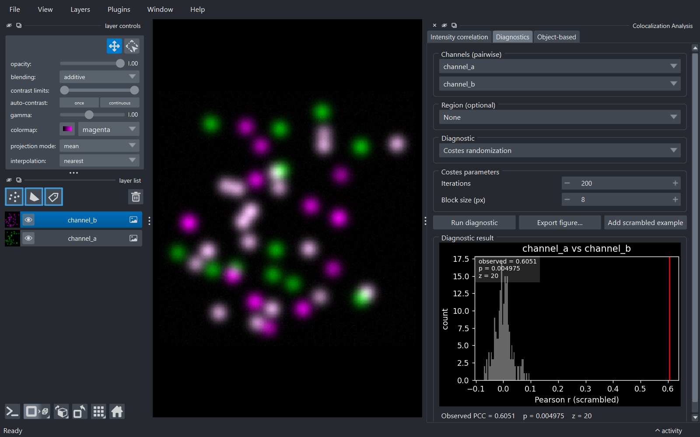
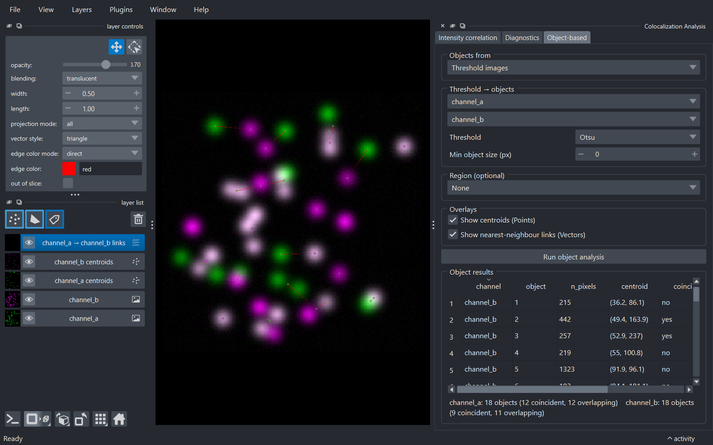

# Usage guide

This page walks through the **Colocalization Analysis** dock widget and its
three tabs.

> Documentation index: [Home](index.md) · **Usage** · [Metrics](metrics.md) · [Python API](api.md)

## Opening the widget

In napari: **Plugins → Colocalization Analysis**. The widget docks on the
right by default. To follow along without your own data, load a sample:
**File → Open Sample → napari-colocalization → Colocalization sample (2D)**.
A 3D synthetic version is also provided, plus **CBS006RBM**, a two-channel
benchmark image (~50 % colocalization) downloaded once and cached under
`~/.cache/napari-colocalization/` from the
[Colocalization Benchmark Source](https://colocalization-benchmark.com).

<figure markdown="span">
  { width=380 }
  <figcaption>The Intensity correlation tab at first open.</figcaption>
</figure>

The widget is split into three tabs, each self-contained (its own channel
selectors and Run button):

- **Intensity correlation** - the per-region metric table and cytofluorogram.
- **Diagnostics** - single-pair diagnostic plots.
- **Object-based** - object-level coincidence and overlap.

## Intensity correlation tab

### Mode

Choose how channels are supplied:

- **Pairwise** *(default)* - pick two separate image layers (e.g.
  `channel_a` and `channel_b`).
- **All-to-all** - pick a single image layer that has a channel axis (e.g.
  shape `(C, Y, X)`); the plugin computes every channel pair `(i, j)` with
  `i < j`.

### Channels

In **pairwise** mode, two layer combos labelled **Image A** and **Image B**,
auto-populated from the viewer's image layers. With at least two images
present, A and B default to *different* layers. Both must have the same
shape.

A **Per Z-slice** checkbox with a **Z axis** spinbox analyses each plane of a
3D stack separately (one result row per slice, tagged in the `slice` column)
instead of the whole volume; it requires a 3D image.

In **all-to-all** mode, a single **Image stack** combo plus a **Channel axis**
spinbox (bounded by the layer's `.ndim`; the plugin guesses a sensible
default). Channel names are derived from the layer name plus the index along
the channel axis (e.g. `stack_0`, `stack_1`).

### Region (optional)

A dropdown listing every **Shapes** and **Labels** layer, with **None** at the
top:

- **None** *(default)* - analyse the whole image (one row per channel pair,
  `region = 0`).
- A **Shapes** layer - each shape is its own region; region IDs match the
  0-based shape indices napari shows on hover.
- A **Labels** layer - each non-zero label is its own region, preserving the
  label values.

The dropdown updates as you add, remove or rename Shapes/Labels layers; image
layers are excluded. The region's spatial shape must match the channels'.

### Correlation metrics

Five checkboxes: **Pearson**, **Spearman**, **Li ICQ**, **Overlap (r, k1, k2)**
and **Manders**. Only **Spearman** is on by default (the most outlier-robust).
Pick any subset; unrequested metrics are blank in the table. See
[metrics.md](metrics.md) for what each one means.

### Manders threshold

Visible only when **Manders** is checked - a **Method** dropdown:

- **Costes (auto)** *(default)* - the iterative Costes threshold (orthogonal
  regression + bisection, matched to Fiji Coloc 2).
- **Otsu / Li / Triangle / Yen / Mean / IsoData** - a per-channel
  histogram threshold (`skimage.filters`), giving the thresholded M1/M2.
- **Manual** - reveals **T_a** / **T_b** spinboxes for explicit values.

In all-to-all mode the chosen method applies to every channel pair.

### Run and results

**Run** computes the metrics on a background thread (the UI stays responsive;
the button disables while running). The **Results** group then appears.

The **table** has one row per *(channel pair, region[, slice])*: `region`,
`slice`, `channel_a`, `channel_b`, `n_pixels`, the metric columns (`pcc` +
`pcc_pvalue`, `srcc` + `srcc_pvalue`, `icq`, `overlap`/`k1`/`k2`, `m1`/`m2`)
and `threshold_a`/`threshold_b`. Click a header to sort; multi-select with
**Ctrl/Shift-click**. If a region's metric can't be computed (too few pixels,
a constant or empty channel) its cell is left blank and a note below the table
summarises how many rows were affected and why.

The **cytofluorogram** below is a 2D **hexbin** density plot of the two
channels' intensities for the selected row, with the axes labelled by the
channel names. Red lines mark the Manders thresholds and a cyan dashed line
shows the Costes regression when those were computed; metric values are
annotated in the corner. **Fixed plot axes** locks the axes to
`[0, channel max]` so plots are comparable across regions, slices and images.

Selecting rows highlights the matching regions in the viewer (a Shapes
outline, or `show_selected_label` for a single Labels row).

Three actions sit below: **Export CSV…** (the table), **Export figure…** (the
cytofluorogram, at a chosen size/DPI and format), and **Add coloc mask
layer** (a Labels layer of the pixels above both Manders thresholds for the
selected row).

## Diagnostics tab

For a single channel pair (its own **Image A**/**Image B** and optional
**Region**), the **Diagnostic** dropdown picks one plot:

- **Costes randomization** - the significance test: channel B is block-
  scrambled many times to build a null PCC distribution, plotted as a
  histogram with the observed PCC, a p-value and a z-score. Parameters:
  **Iterations** and **Block size**. 2D or 3D.
- **Van Steensel CCF** - Pearson's r as channel B is shifted across
  **Max shift** pixels; a peak at 0 indicates colocalization.
- **Li ICA** - the intensity-correlation-analysis scatter (intensity vs
  covariance product) for each channel, with the ICQ value.

<figure markdown="span">
  { width=520 }
  <figcaption>Costes randomization on the Diagnostics tab.</figcaption>
</figure>

**Run diagnostic** renders the plot and a one-line summary. **Export
figure…** saves it. For Costes randomization, **Add scrambled example** adds
one block-scrambled copy of Image B to the viewer as an Image layer.

## Object-based tab

Compares segmented *objects* between two channels. **Objects from** chooses
the source:

- **Threshold images** *(default)* - pick **Image A**/**Image B**, a
  **Threshold** method (Otsu/Li/…) and a **Min object size**; the plugin
  thresholds and connected-component-labels each channel. An optional
  **Region** restricts detection.
- **Labels layers** - pick two existing **Labels** layers (e.g. from
  cellpose/StarDist or manual painting).

**Overlays** toggles **Show centroids (Points)** and **Show
nearest-neighbour links (Vectors)**.

<figure markdown="span">
  { width=520 }
  <figcaption>Object-based coincidence and overlap.</figcaption>
</figure>

**Run object analysis** fills the **Object results** table - one row per
object (`channel`, `object`, `n_pixels`, `centroid`, `coincident`,
`overlap`) - with a per-channel summary below. *Coincident* means the
object's centroid falls inside an object of the other channel; *overlap*
means its pixels touch one. If overlays are enabled, object centroids are
added as Points layers (coloured by each channel's colormap) and the
nearest-neighbour links as a Vectors layer; re-running replaces them.
