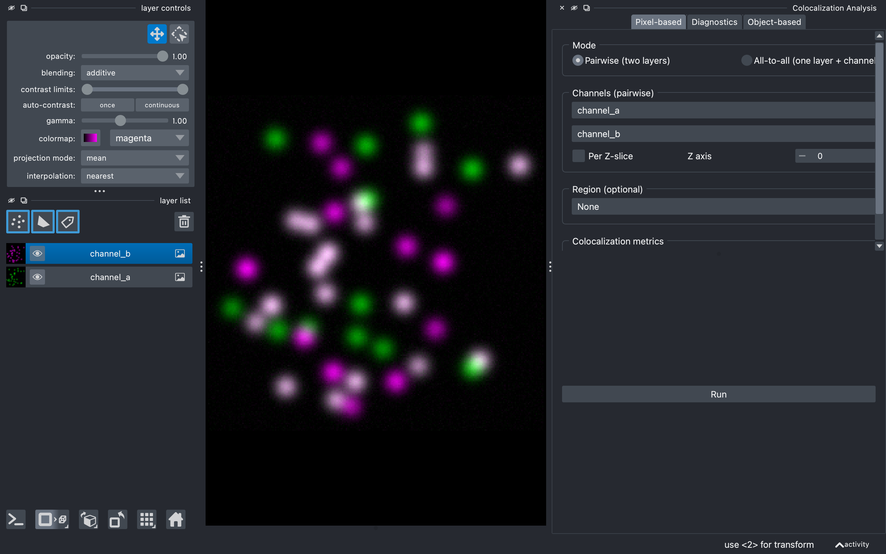
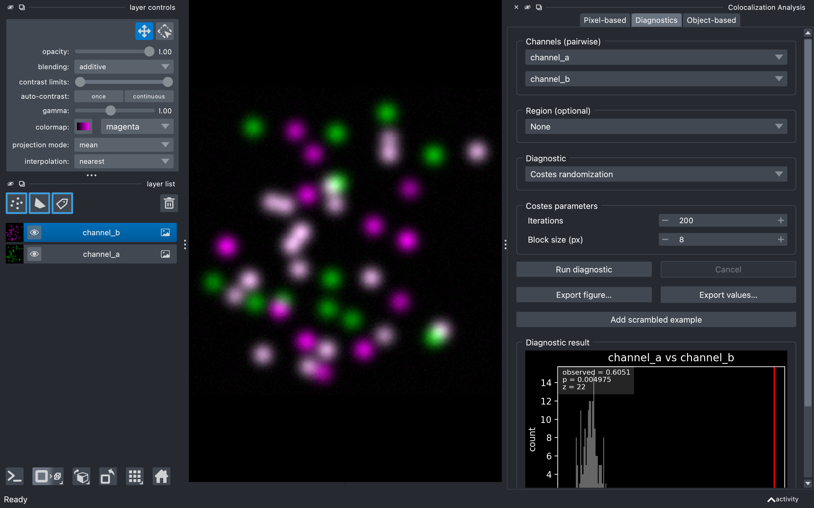
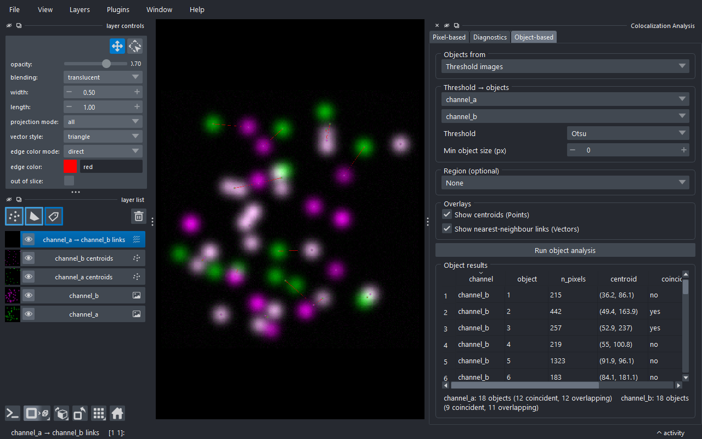

# Usage guide

This page walks through the **Colocalization Analysis** dock widget and its
three tabs.

> Documentation index: [Home](index.md) · **Usage** · [Metrics](metrics.md) · [Python API](api.md)

## Opening the widget

In napari: **Plugins → Colocalization Analysis**. The widget docks on the
right by default. To follow along without your own data, load a sample:
**File → Open Sample → napari-colocalization → Colocalization sample (2D)**.
A 3D synthetic version is also provided, plus **CBS006RBM**, a two-channel
benchmark image (~50 % colocalization) downloaded once and cached under
`~/.cache/napari-colocalization/` from the
[Colocalization Benchmark Source](https://colocalization-benchmark.com).

<figure markdown="span">
  { width=380 }
  <figcaption>The Pixel-based tab at first open.</figcaption>
</figure>

The widget is split into three tabs, each self-contained (its own channel
selectors and Run button):

- **Pixel-based** - the per-region metric table and cytofluorogram.
- **Diagnostics** - single-pair diagnostic plots.
- **Object-based** - object-level coincidence and overlap.

## Pixel-based tab

### Mode

Choose how channels are supplied:

- **Pairwise** *(default)* - pick two separate image layers (e.g.
  `channel_a` and `channel_b`).
- **All-to-all** - pick a single image layer that has a channel axis (e.g.
  shape `(C, Y, X)`); the plugin computes every channel pair `(i, j)` with
  `i < j`.

### Channels

In **pairwise** mode, two layer combos labelled **Image A** and **Image B**,
auto-populated from the viewer's image layers. With at least two images
present, A and B default to *different* layers. Both must have the same
shape.

A **Per Z-slice** checkbox with a **Z axis** spinbox analyses each plane of a
3D stack separately (one result row per slice, tagged in the `slice` column)
instead of the whole volume; it requires a 3D image.

In **all-to-all** mode, a single **Image stack** combo plus a **Channel axis**
spinbox (bounded by the layer's `.ndim`; the plugin guesses a sensible
default). Channel names are derived from the layer name plus the index along
the channel axis (e.g. `stack_0`, `stack_1`).

### Region (optional)

A dropdown listing every **Shapes** and **Labels** layer, with **None** at the
top:

- **None** *(default)* - analyse the whole image (one row per channel pair,
  `region = 0`).
- A **Shapes** layer - each shape is its own region; region IDs match the
  0-based shape indices napari shows on hover.
- A **Labels** layer - each non-zero label is its own region, preserving the
  label values.

The dropdown updates as you add, remove or rename Shapes/Labels layers; image
layers are excluded. The region's spatial shape must match the channels'.

### Colocalization metrics

Five checkboxes: **Pearson**, **Spearman**, **Li ICQ**, **Overlap (r, k1, k2)**
and **Manders**. The first three measure intensity *correlation*; Overlap
and Manders measure *co-occurrence*
(see [metrics.md](metrics.md#co-occurrence-versus-correlation)).
Only **Spearman** is on by default (the most outlier-robust).
Pick any subset; unrequested metrics are blank in the table. See
[metrics.md](metrics.md) for what each one means.

### Manders threshold

Visible only when **Manders** is checked - a **Method** dropdown:

- **Costes (auto)** *(default)* - the iterative Costes threshold (orthogonal
  regression + bisection, matched to Fiji Coloc 2).
- **Otsu / Li / Triangle / Yen / Mean / IsoData** - a per-channel
  histogram threshold (`skimage.filters`), giving the thresholded tM1/tM2.
- **Manual** - reveals **T_a** / **T_b** spinboxes for explicit values. Each
  box is seeded from its channel's own intensity range: the bounds match the
  layer, the step is a hundredth of that range, and the tooltip spells the
  range out — so a 16-bit channel steps in hundreds rather than in 0.01, and a
  normalised 0–1 channel keeps full precision. Changing the selected layer
  re-seeds the box, since a threshold from a channel with a different range
  no longer means anything.

In all-to-all mode the chosen method applies to every channel pair.

### Run and results

**Run** computes the metrics on a background thread (the UI stays responsive;
the button disables while running). The **Results** group then appears.

The **table** has one row per *(channel pair, region[, slice])*: `region`,
`slice`, `channel_a`, `channel_b`, `n_pixels`, the metric columns (`pcc` +
`pcc_pvalue`, `srcc` + `srcc_pvalue`, `icq`, `overlap`/`k1`/`k2`, `tm1`/`tm2`)
and `threshold_a`/`threshold_b`. Click a header to sort; multi-select with
**Ctrl/Shift-click**. If a region's metric can't be computed (too few pixels,
a constant or empty channel) its cell is left blank and a note below the table
summarises how many rows were affected and why.

The **cytofluorogram** below is a 2D **hexbin** density plot of the two
channels' intensities for the selected row, with the axes labelled by the
channel names. Red lines mark the Manders thresholds and a cyan dashed line
shows the Costes regression when those were computed; metric values are
annotated in the corner. **Fixed plot axes** locks the axes to
`[0, channel max]` so plots are comparable across regions, slices and images.

Selecting rows highlights the matching regions in the viewer (a Shapes
outline, or `show_selected_label` for a single Labels row).

Three actions sit below: **Export CSV…** (the table), **Export figure…** (the
cytofluorogram, at a chosen size/DPI and format), and **Add coloc mask
layer** (a Labels layer of the pixels above both Manders thresholds for the
selected row). See [Exported CSVs](#exported-csvs) for what the file records
beyond the table itself.

## Diagnostics tab

For a single channel pair (its own **Image A**/**Image B** and optional
**Region**), the **Diagnostic** dropdown picks one plot:

- **Costes randomization** - the significance test: channel B is block-
  scrambled many times to build a null PCC distribution, plotted as a
  histogram with the observed PCC, a p-value and a z-score. Parameters:
  **Iterations** and **Block size**. 2D or 3D.
- **Van Steensel CCF** - Pearson's r as channel B is shifted across
  **Max shift** pixels; a peak at 0 indicates colocalization.
- **Li ICA** - the intensity-correlation-analysis scatter (intensity vs
  covariance product) for each channel, with the ICQ value.

<figure markdown="span">
  { width=520 }
  <figcaption>Costes randomization on the Diagnostics tab.</figcaption>
</figure>

**Run diagnostic** renders the plot and a one-line summary. Costes
randomization and the CCF report progress on a bar while they run, and
**Cancel** stops them at the next iteration — worth knowing before setting
**Iterations** high, since the null is built one scramble at a time and
100 000 of them takes minutes. A cancelled run leaves the previous result
cleared and the controls ready for another go.

**Export figure…** saves the picture; **Export values…** saves the numbers behind it
as CSV — the null distribution (`iteration`, `null_pcc`) for Costes, the
curve (`shift_px`, `pearson_r`) for the CCF, or the per-pixel points (`a`,
`b`, `product`) for Li ICA. The run's scalars (observed PCC, p, z, or ICQ)
ride along as extra columns. Both buttons stay disabled until a diagnostic
has been run. For Costes randomization, **Add scrambled example** adds one
block-scrambled copy of Image B to the viewer as an Image layer.

Note that the Li ICA export is one row *per pixel*, so it can be a large
file for a big stack; the confirmation message reports the row count.

## Object-based tab

Compares segmented *objects* between two channels. **Objects from** chooses
the source:

- **Threshold images** *(default)* - pick **Image A**/**Image B**, a
  **Threshold** method (Otsu/Li/…) and a **Min object size**; the plugin
  thresholds and connected-component-labels each channel. An optional
  **Region** restricts detection.
- **Labels layers** - pick two existing **Labels** layers (e.g. from
  cellpose/StarDist or manual painting).

**Overlays** toggles **Show centroids (Points)** and **Show
nearest-neighbour links (Vectors)**.

<figure markdown="span">
  { width=520 }
  <figcaption>Object-based coincidence and overlap.</figcaption>
</figure>

**Run object analysis** fills the **Object results** table - one row per
object (`channel`, `object`, `n_pixels`, `centroid`, `coincident`,
`overlap`, `nn_distance_px`). *Coincident* means the object's centroid
falls inside an object of the other channel; *overlap* means its pixels
touch one.

`nn_distance_px` is the distance from the object's centroid to the nearest
centroid in the *other* channel. It is the graded companion to the two
yes/no measures: an object
that misses by 2 px and one that misses by 200 px both read as "no", but
they are not the same result. The distance is in **pixels**, matching
`n_pixels` and the centroid columns beside it — the plugin does not apply a
layer's physical `scale` anywhere, so convert yourself if you need microns.
It is blank when the other channel has no objects to measure to. If overlays are enabled, object centroids are
added as Points layers (coloured by each channel's colormap) and the
nearest-neighbour links as a Vectors layer; re-running replaces them.

**Export CSV…** (next to the Run button, disabled until there are results)
saves the per-object table. The `centroid` tuple is split into one column per
axis — `centroid_0`, `centroid_1` and, for a 3D image, `centroid_2` — so the
coordinates are usable downstream without string-parsing.

## Exported CSVs

All three tabs write plain CSV that opens unchanged in Excel or
`pandas.read_csv` (no `comment=` flag needed). Alongside the data columns,
each file repeats a few **provenance** columns on every row, recording how the
run was configured:

| Column | Meaning |
|---|---|
| `plugin_version` | the plugin version that computed the numbers |
| `analysed_at` | local timestamp of the run |
| `region_layer` | the Shapes/Labels layer used, or blank for whole-image |
| `mode`, `metrics`, `threshold_method`, `slice_axis` | Pixel-based run settings |
| `objects_from`, `threshold_method`, `min_object_size` | Object-based run settings |
| `diagnostic`, `channel_a`/`channel_b`, `n_iter`, `block_size`, `max_shift` | Diagnostics run settings |

Fields that don't apply are left blank rather than filled with a default — a
`threshold_method` of `costes` is only recorded if Manders was actually
requested, so an empty cell means "no threshold was applied", not "unknown".
The point is that a saved file says how it was produced: the metric columns
alone can't tell a reader whether `threshold_a` came from Costes, Otsu, or a
number typed by hand.
